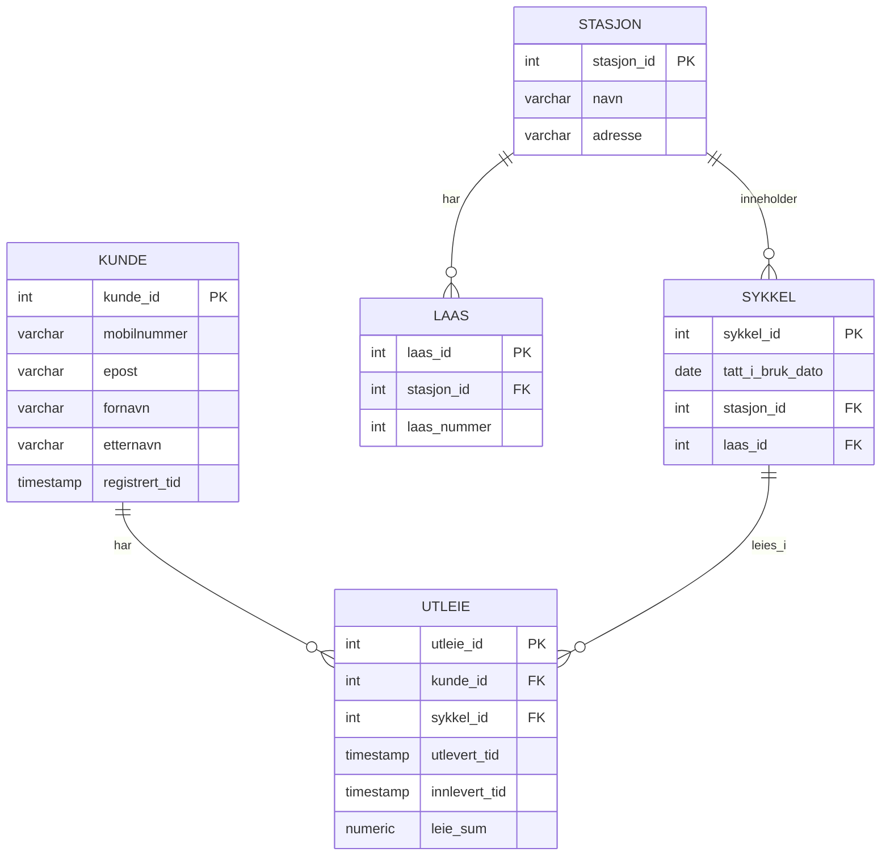

# Besvarelse - Refleksjon og Analyse

**Student:** [Ditt navn]

**Studentnummer:** [Ditt studentnummer]

**Dato:** [Innleveringsdato]

---

## Del 1: Datamodellering

### Oppgave 1.1: Entiteter og attributter

**Identifiserte entiteter:**

- Kunde
- Stasjon
- Lås
- Sykkel
- Utleie

**Attributter for hver entitet:**

Kunde:
- kunde_id
- mobilnummer
- epost
- fornavn
- etternavn
- registrert_tid

Stasjon:
- stasjon_id
- navn
- adresse

Lås:
- laas_id
- stasjon_id
- laas_nummer

Sykkel:
- sykkel_id
- tatt_i_bruk_dato
- stasjon_id
- laas_id

Utleie:
- utleie_id
- kunde_id
- sykkel_id
- utlevert_tid
- innlevert_tid
- leie_sum

Begrunnelse:

Disse entitetene er identifisert basert på case beskrivelsen. 
Systemet må holde styr på kunder som registrerer seg og leier sykler, 
sykler som står på de forskjellige stasjonene, og låses med en lås, samtidig som utleieforhold 
registrerer starttidspunkt, sluttidspunkt og leiebeløp. 
Entitetene dekker alle nødvendige objekter i systemet uten å inkludere 
irrelevante elementer.

---

### Oppgave 1.2: Datatyper og `CHECK`-constraints

**Valgte datatyper og begrunnelser:**

Kunde:

- kunde_id: INTEGER (brukes som unik identifikator for hver kunde. Implementeres som auto-generert primærnøkkel i databasen.)
- mobilnummer: VARCHAR(15) (passelig lengde for ett telefonnummer, siden de kan variere i lengde og kan inkludere landskode)
- epost: VARCHAR(100) (tilstrekkelig lengde for ett tekstfelt for e-postadresser, kan variere i lengde, har derfor litt god margin)
- fornavn: VARCHAR(50) (tekstfelt for fornavn)
- etternavn: VARCHAR(50) (tekstfelt for etternavn)
- registrert_tid: TIMESTAMP (registrering skjer på et bestemt tidspunkt)

Stasjon:

- stasjon_id: INTEGER (unik identifikator for hver stasjon)
- navn: VARCHAR(100) (tekstfelt for stasjonsnavn)
- adresse: VARCHAR(100) (tekstfelt for adresse)

Lås:

- laas_id: INTEGER (unik identifikator for hver lås)
- stasjon_id: INTEGER (refererer til hvilken stasjon låsen tilhører)
- laas_nummer: INTEGER (nummer på låsen innenfor stasjonen)

Sykkel:

- sykkel_id: INTEGER (unik identifikator for hver sykkel)
- tatt_i_bruk_dato: DATE (dato sykkelen ble tatt i bruk)
- stasjon_id: INTEGER (refererer til hvilken stasjon sykkelen er plassert på, kan være NULL når sykkelen er utleid)
- laas_id: INTEGER (refererer til hvilken lås sykkelen er festet til, kan være NULL når sykkelen er utleid)

Utleie:

- utleie_id: INTEGER (unik identifikator for hvert utleieforhold)
- kunde_id: INTEGER (refererer til kunden som leier sykkelen)
- sykkel_id: INTEGER (refererer til sykkelen som leies)
- utlevert_tid: TIMESTAMP (tidspunkt for når sykkelen ble låst opp)
- innlevert_tid: TIMESTAMP (tidspunkt for når sykkelen ble levert tilbake, kan være NULL hvis den ikke er levert ennå)
- leie_sum: er valgt som NUMERIC(10,2) for å kunne lagre beløp med to desimaler.


**`CHECK`-constraints:**

Følgende CHECK-constraints er lagt til for å sikre dataintegritet:

- mobilnummer: sikres med CHECK slik at verdien kun inneholder sifre og eventuelt starter med "+"
- epost: må inneholde "@" og et domene (grunnleggende validering av format).
- laas_nummer: må være større enn 0.
- leie_sum: må være større enn eller lik 0.
- innlevert_tid: må være senere enn utlevert_tid, eller NULL dersom sykkelen ikke er levert enda.

**ER-diagram:**




---

### Oppgave 1.3: Primærnøkler

**Valgte primærnøkler og begrunnelser:**

For hver entitet har jeg valgt en egen ID som primærnøkkel. Disse er representert i form av kunde_id, stasjon_id, laas_id, sykkel_id, og utleie_id. Disse brukes til å identifisere hver rad unikt i tabellen.

- Kunde: kunde_id er valgt som primærnøkkel, fordi den identifiserer hver kunde unikt i systemet.
- Stasjon: stasjon_id er valgt som primærnøkkel, fordi hver stasjon må kunne skilles fra andre uavhengig av navn eller adresse.
- Lås: laas_id er valgt som primærnøkkel, fordi laas_nummer kan gjentas på ulike stasjoner, og vi trenger derfor en annen identifikator.
- Sykkel: sykkel_id er valgt som primærnøkkel, fordi hver sykkel i systemet har en unik ID.
- Utleie: utleie_id er valgt som primærnøkkel, fordi hvert utleieforhold må kunne identifiseres som en egen hendelse.

Jeg har valgt å bruke egne ID-er i stedet for for eksempel e-post eller mobilnummer, fordi slike verdier kan endre seg over tid. En kunde kan bytte e-postadresse eller telefonnummer, men kunde_id skal være stabil og aldri endres. Dette gjør databasen mer robust og enklere og vedlikeholde

For lås kunne man for eksempel brukt en kombinasjon av stasjon_id og laas_nummer som naturlig nøkkel, men jeg har valgt å bruke laas_id som en egen primærnøkkel for å gjøre modellen enklere og mer oversiktlig.

**Naturlige vs. surrogatnøkler:**

I denne modellen brukes det hovedsakelig surrogatnøkler. Jeg har valgt dette for å gjøre databasen enklere å jobbe med, samtidig som den blir mer robust dersom andre attributter endrer seg. 

**Oppdatert ER-diagram:**

ER-diagrammet fra 1.2 er oppdatert, og består av primærnøkler og fremmednøkler. Se diagram over.

---

### Oppgave 1.4: Forhold og fremmednøkler

**Identifiserte forhold og kardinalitet:**

- En stasjon har flere låser, og hver lås tilhører en spesifikk stasjon (en-til-mange)
- En stasjon kan inneholde mange sykler, og en sykkel kan stå på en stasjon, med mindre den er utleid, da er den ikke knyttet til en stasjon. (en-til-mange)
- En kunde kan ha mange utleieforhold over tid, og hver utleie gjelder en enkelt kunde. (en-til-mange)
- En sykkel kan være med i mange utleiefohold over tid, og hvert utleieforhold inkluderer en sykkel. (en-til-mange)

**Fremmednøkler:**

- I tabellen Laas (lås) finnes kolonnen stasjon_id. Denne peker til primærnøkkelen stasjon_id i tabellen Stasjon og viser hvilken stasjon en lås tilhører.
- I tabellen Sykkel, finner vi også kolonnen stasjon_id. Denne peker igjen til Stasjon og viser hvilken stasjon sykelen står på. Denne kan være NULL hvis sykkelen er utleid.
- I tabellen Sykkel finner vi også kolonnen laas_id. Denne peker til primærnøkkelen laas_id i tabellen Laas, og viser hvilken lås sykkelen er festet i. Denne kan også være NULL dersom sykelen er utleid. Siden da er ikke sykkelen festet i noe lås.
- I tabellen Utleie ser vi kolonnen kunde_id. Denne sikter til primærnøkkelen kunde_id i tabellen Kunde, og viser hvilken kunde som har starta utleieforholdet.
- I tabellen Utleie finner vi også kolonnen sykkel_id, som sikter til primærnøkkelen sykkel_id i tabellen Sykkel. Og den viser hvilken sykkel som er leid.

Fremmednøklene sørger for at databasen ikke kan registrere et utleieforhold for en kunde, eller en sykkel, som ikke finnes i systemet.

**Oppdatert ER-diagram:**

ER-diagrammet er oppdatert og viser både relasjoner og fremmednøkler. ( Se mermaid-diagram over)

---

### Oppgave 1.5: Normalisering

**Vurdering av 1. normalform (1NF):**

Datamodellen min tilfredstiller 1NF fordi det kun lagres en verdi i hver kolonne per rad. Det finnes ingen kolonner som inneholder flere verdier samtidig. Dette betyr at tabellene ikke har gjentakende grupper, og at alle verdiene er enkeltstående.

**Vurdering av 2. normalform (2NF):**

Datamodellen er i 2NF fordi alle tabeller har en enkel primærnøkkel, altså en ID per tabell. Det finnes ingen sammensatte primærnøkler, og alle andre attributter i tabellen er avhengige av den ene primærnøkkelen.

**Vurdering av 3. normalform (3NF):**

Datamodellen er i 3NF fordi hver type informasjon er plassert i korrekt tabell. For eksempel lagres kundeinformasjon kun i tabellen Kunde, og ikke Utleie. På samme måte lagres informasjon om sykler, stasjoner og låser i egne tabeller. Dette gjør at data ikke lagres flere steder enn nødvendig og reduserer risikoen for feil og dupliserting.


**Eventuelle justeringer:**

Modellen vurderes til å være i 3NF, så det var ikke nødvendig å gjøre noen justeringer.

---

## Del 2: Database-implementering

### Oppgave 2.1: SQL-skript for database-initialisering

**Plassering av SQL-skript:**

SQL-skriptet for oprettelsen av tabeller og innsetting av testdata er plassert riktig i mappen init-scripts med filnavnet 01-init-database.sql.

**Antall testdata:**

- Kunder: 5
- Sykler: 100
- Sykkelstasjoner: 5
- Låser: 100
- Utleier: 50

---

### Oppgave 2.2: Kjøre initialiseringsskriptet

**Dokumentasjon av vellykket kjøring:**

Initialiseringsskriptet ble kjørt via Docker ved hjelp av kommandoen:

cat init-scripts/01-init-database.sql | docker compose exec -T postgres psql -U admin -d oblig01

Tabellene ble oprettet og testdata satt inn. 

**Spørring mot systemkatalogen:**

```sql
SELECT table_name 
FROM information_schema.tables 
WHERE table_schema = 'public' 
  AND table_type = 'BASE TABLE'
ORDER BY table_name;
```

**Resultat:**

```
 table_name 
------------
 kunde
 laas
 stasjon
 sykkel
 utleie
(5 rows)
```

---

## Del 3: Tilgangskontroll

### Oppgave 3.1: Roller og brukere

**SQL for å opprette rolle:**

```sql
CREATE ROLE kunde;
```

**SQL for å opprette bruker:**

```sql
CREATE USER kunde_1 WITH PASSWORD 'kunde123';
```

**SQL for å tildele rettigheter:**

```sql
GRANT kunde TO kunde_1;
```

Jeg har valgt å gi brukeren lesetilgang til tabellene Stasjon og Sykkel, da disse inneholder informasjon som er relevant for en kunde i dette systemet. Tabellen Kunde og Utleie har jeg valgt å utelukke for brukeren, for å unngå innsyn i andre kunders personopplysninger og utleiehistorikk. 

```sql
GRANT SELECT ON Stasjon TO kunde;
GRANT SELECT ON Sykkel TO kunde;
```

---

### Oppgave 3.2: Begrenset visning for kunder

**SQL for VIEW:**

```sql
CREATE OR REPLACE VIEW kunde_1_utleier AS
SELECT utleie_id, sykkel_id, utlevert_tid, innlevert_tid, leie_sum
FROM Utleie
WHERE kunde_id = 1;

GRANT SELECT ON kunde_1_utleier TO kunde;
```

I dette eksemplet er brukeren kunde_1 knyttet til kunde_id = 1, og viewet filtrerer derfor på denne kunden.

**Ulempe med VIEW vs. POLICIES:**

En ulempe med å bruke VIEW for autorisasjon er at sikkerheten ikke ligger direkte på selve tabellen. Hvis en bruker på en eller annan måte får tilgang til den underliggende tabellen, kan viewet omgås og brukeren kan se mer data enn det som var ment. Med POLICIES håndheves tilgangen direkte på tabellen, slik at brukeren kun får tilgang til tillatte rader uansett hvordan dataene hentes.

---

## Del 4: Analyse og Refleksjon

### Oppgave 4.1: Lagringskapasitet

**Gitte tall for utleierate:**

- Høysesong (mai-september): 20000 utleier/måned
- Mellomsesong (mars, april, oktober, november): 5000 utleier/måned
- Lavsesong (desember-februar): 500 utleier/måned

**Totalt antall utleier per år:**

[Skriv din utregning her]

**Estimat for lagringskapasitet:**

[Skriv din utregning her - vis hvordan du har beregnet lagringskapasiteten for hver tabell]

**Totalt for første år:**

[Skriv ditt estimat her]

---

### Oppgave 4.2: Flat fil vs. relasjonsdatabase

**Analyse av CSV-filen (`data/utleier.csv`):**

**Problem 1: Redundans**

[Skriv ditt svar her - gi konkrete eksempler fra CSV-filen som viser redundans]

**Problem 2: Inkonsistens**

[Skriv ditt svar her - forklar hvordan redundans kan føre til inkonsistens med eksempler]

**Problem 3: Oppdateringsanomalier**

[Skriv ditt svar her - diskuter slette-, innsettings- og oppdateringsanomalier]

**Fordeler med en indeks:**

[Skriv ditt svar her - forklar hvorfor en indeks ville gjort spørringen mer effektiv]

**Case 1: Indeks passer i RAM**

[Skriv ditt svar her - forklar hvordan indeksen fungerer når den passer i minnet]

**Case 2: Indeks passer ikke i RAM**

[Skriv ditt svar her - forklar hvordan flettesortering kan brukes]

**Datastrukturer i DBMS:**

[Skriv ditt svar her - diskuter B+-tre og hash-indekser]

---

### Oppgave 4.3: Datastrukturer for logging

**Foreslått datastruktur:**

[Skriv ditt svar her - f.eks. heap-fil, LSM-tree, eller annen egnet datastruktur]

**Begrunnelse:**

**Skrive-operasjoner:**

[Skriv ditt svar her - forklar hvorfor datastrukturen er egnet for mange skrive-operasjoner]

**Lese-operasjoner:**

[Skriv ditt svar her - forklar hvordan datastrukturen håndterer sjeldne lese-operasjoner]

---

### Oppgave 4.4: Validering i flerlags-systemer

**Hvor bør validering gjøres:**

[Skriv ditt svar her - argumenter for validering i ett eller flere lag]

**Validering i nettleseren:**

[Skriv ditt svar her - diskuter fordeler og ulemper]

**Validering i applikasjonslaget:**

[Skriv ditt svar her - diskuter fordeler og ulemper]

**Validering i databasen:**

[Skriv ditt svar her - diskuter fordeler og ulemper]

**Konklusjon:**

[Skriv ditt svar her - oppsummer hvor validering bør gjøres og hvorfor]

---

### Oppgave 4.5: Refleksjon over læringsutbytte

**Hva har du lært så langt i emnet:**

[Skriv din refleksjon her - diskuter sentrale konsepter du har lært]

**Hvordan har denne oppgaven bidratt til å oppnå læringsmålene:**

[Skriv din refleksjon her - koble oppgaven til læringsmålene i emnet]

Se oversikt over læringsmålene i en PDF-fil i Canvas https://oslomet.instructure.com/courses/33293/files/folder/Plan%20v%C3%A5ren%202026?preview=4370886

**Hva var mest utfordrende:**

[Skriv din refleksjon her - diskuter hvilke deler av oppgaven som var mest krevende]

**Hva har du lært om databasedesign:**

[Skriv din refleksjon her - reflekter over prosessen med å designe en database fra bunnen av]

---

## Del 5: SQL-spørringer og Automatisk Testing

**Plassering av SQL-spørringer:**

[Bekreft at du har lagt SQL-spørringene i `test-scripts/queries.sql`]


**Eventuelle feil og rettelser:**

[Skriv ditt svar her - hvis noen tester feilet, forklar hva som var feil og hvordan du rettet det]

---

## Del 6: Bonusoppgaver (Valgfri)

### Oppgave 6.1: Trigger for lagerbeholdning

**SQL for trigger:**

```sql
[Skriv din SQL-kode for trigger her, hvis du har løst denne oppgaven]
```

**Forklaring:**

[Skriv ditt svar her - forklar hvordan triggeren fungerer]

**Testing:**

[Skriv ditt svar her - vis hvordan du har testet at triggeren fungerer som forventet]

---

### Oppgave 6.2: Presentasjon

**Lenke til presentasjon:**

[Legg inn lenke til video eller presentasjonsfiler her, hvis du har løst denne oppgaven]

**Hovedpunkter i presentasjonen:**

[Skriv ditt svar her - oppsummer de viktigste punktene du dekket i presentasjonen]

---

**Slutt på besvarelse**
